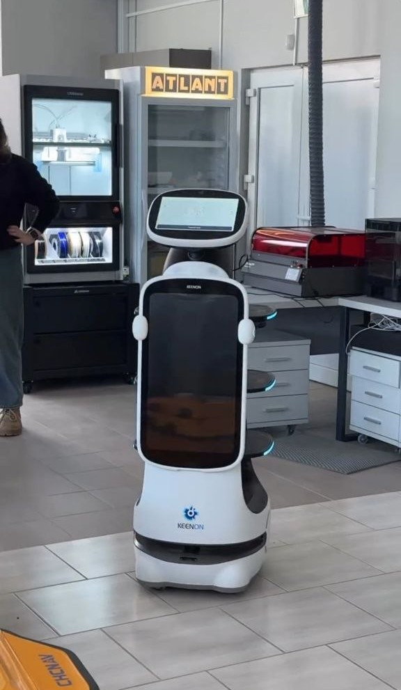

# Guide-robot-Keenon

Creating software for a robotic tour guide based on the Keenon robot

---

## Table of Contents

1. [About the Project](#-about-the-project)
2. [Requirements Analysis](#-requirements-analysis)
3. [Development and Testing](#-development-and-testing)
4. [Excursion Route](#-excursion-route)
5. [Implementation of Voice Guidance](#-implementation-of-voice-guidance)
6. [Results](#-results)

---

## 📖 About the Project

The project aims to create software for a robotic tour guide based on the Keenon robotic waiter. The robot is used to conduct tours at the Industrial Robotics and Digital Engineering Competence Center at Brest State Technical University.

---

## 📊 Requirements Analysis

### Key questions that were addressed:

| Question | Solution |
|----------|----------|
| **Requirements from our beloved lab owner** | To quote: "Do whatever you want, and as much as you think you can accomplish in 6 lab sessions. If I tell you to paint the lab, and you say you can paint 1 square meter in 6 labs, then that's how it is." |
| **Is there documentation, and where can we get it?** | We obtained the manuals from the wonderful lab staff member Alla (the best woman ever). |
| **What control method is used?** | He's an independent boy, he can walk on his own (P.S. but not always). |

### Available Components

During our work in the lab, we studied the Keenon documentation:
- [Delivery Robot Deployment Standards](https://drive.google.com/drive/folders/1fNvKaHVhsuuSYGf5xpiLR8Y7fz7URTRt?usp=drive_link)
- [T10 Robot Technical Documentation](https://drive.google.com/drive/folders/1fNvKaHVhsuuSYGf5xpiLR8Y7fz7URTRt?usp=drive_link)
- [APP User Manual](https://drive.google.com/drive/folders/1fNvKaHVhsuuSYGf5xpiLR8Y7fz7URTRt?usp=drive_link)

---

## 🛠️ Development and Testing

The following tasks were completed during the project:

1. Creating a custom map of the premises
2. Configuring the map according to location specifics
3. Setting up restriction lines (prohibited zones)
4. Creating an excursion plan
5. Identifying stopping points for the excursion
6. Writing the excursion text
7. Creating audio based on the text
8. Uploading audio to the robot's memory
9. Assigning audio to specific points
10. Running and testing test routes

---

## 🎙️ Excursion Route

### Excursion Text

The excursion includes the following key points:

| Route Point | Description |
|-------------|-------------|
| **Start** | Welcoming guests, introducing the Competence Center |
| **VIP Table** | Highlighting the head of the laboratory, Valery Viktorovich Kasyanik |
| **Industrial Manipulators** | Demonstration of industrial robots and their capabilities |
| **Robot Dog** | Presentation of the quadruped robot with AI functions |
| **Humanoid Robot** | A unique development — the first humanoid in Belarusian universities |
| **Finale** | Concluding remarks, invitation to collaborate |

**Full excursion text:** [EXCURSION TEXT.docx](https://github.com/Katapo13/Guide-robot-Keenon/blob/main/%D0%A2%D0%95%D0%9A%D0%A1%D0%A2%20%D0%AD%D0%9A%D0%A1%D0%9A%D0%A3%D0%A0%D0%A1%D0%98%D0%98.docx)

🎵 **Audio accompaniment:** [Listen here](https://drive.google.com/drive/folders/1k_Q0Nts54swbHzKWSY5EaTY6Tia4i7sw?usp=sharing)

---

> *Link to the video of the robotic tour guide in action will be added here*

> **Note:** The map created during the second stage was maliciously deleted and had to be recreated during this stage.

---

## 🏆 Results

### What was accomplished:

- Conducted requirements analysis for excursion functionality
- Studied Keenon robot technical documentation
- Created and configured a map of the premises
- Developed an excursion route with key points
- Prepared the excursion text
- Created audio accompaniment for each point
- Selected optimal robot operating modes
- Integrated audio into the route
- Conducted robot operation testing

---

## 👥 Project Team

The project was completed by the best students of BrSTU (yes, that's us!):
- Katsiaryna Mitskevich
- Anna Kot

---

## 🙏 Acknowledgments

Special thanks to the head of the Industrial Robotics Laboratory, **Valery Viktorovich Kasyanik**, for his support and for providing the opportunity to work with the equipment.

And the greatest gratitude goes to our lab instructor, **Anastasia Valeryevna Yakimuk**, for her patience and great sense of humor ;)

---

*Thank you for being with us until the end!* 